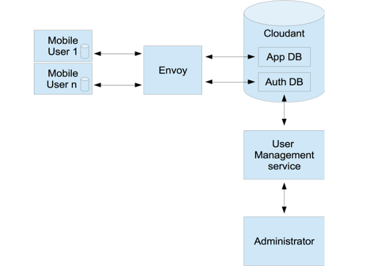

# Cloudant Envoy (beta)

 

## Beta software

Note: this is beta; it's not battle tested or supported in any way. If you find bugs (of which there will be plenty), do let us know – or better, consider a pull request. You know what beta means, right?

## Introduction

### Why use Envoy?

Database-per-user is a common pattern with CouchDB when there is a requirement for each application user to have their own set of documents which can be synced (e.g. to a mobile device or browser). On the surface, this is a good solution - Cloudant handles a large number of databases within a single installation very well. However, there are some problems.  See [here](./docs/README_WHY_ENVOY.md) for more info when to use Cloudant Envoy.

### What is Envoy?

Cloudant Envoy is a microservice that acts as a replication target for your [PouchDB](https://pouchdb.com/) web app or [Cloudant Sync](https://cloudant.com/product/cloudant-features/sync/)-based native app. Envoy allows your client side code can adopt a "one database per user" design pattern, with a copy of a user's data stored on the mobile device and synced to the cloud when online, while invisibly storing all the users' data in one large database. This prevents the proliferation of database that occurs as users are added and facilitates simpler backup and server-side reporting.

Envoy implements a subset of the CouchDB API and can be used as a replication target for PouchDB or Cloudant Sync, or used with custom replicators such as [pouchdb-envoy](https://www.npmjs.org/package/pouchdb-envoy). 

The diagram below shows a high level overview of Envoy:

This diagram shows how a mobile application would typically interact with Envoy:

## Installation

There are a few ways to get started with Envoy depending on your goals:

- Demo installation
- Developer installation
- Production Installation 
- Using Envoy as a library

## Configuring

The default setup will be suitable for most use cases, however it is possible to configure Envoy's:

  - Authentication
  - Access

See [here](./docs/README_PLUGINS.md) for more information.

## Help!

If you have an issue with Envoy, then please check to see if someone else has raised it already in our [issues page](https://github.com/cloudant-labs/envoy/issues). Please [raise an issue](https://github.com/cloudant-labs/envoy/issues/new) for any problems you encounter and we'll see if we can help.

## Links

* [source code](https://github.com/cloudant-labs/envoy)
* [wiki](https://github.com/cloudant-labs/envoy/wiki)
